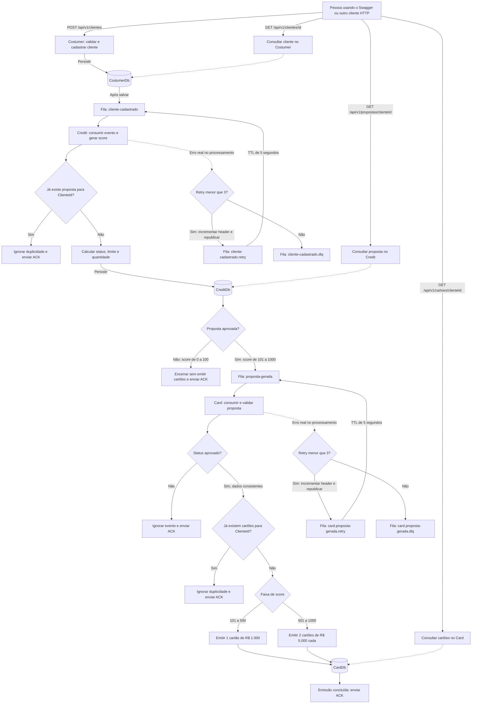

# Credit Flow — do cadastro à emissão de cartões

Este projeto simula uma jornada de crédito: uma pessoa é cadastrada, recebe uma análise simplificada e, se aprovada, tem um ou dois cartões emitidos.

Cada projeto possui seu próprio repositório, com uso de **commits semânticos** para registrar as alterações:

- **Costumer — cadastro de clientes:** [https://github.com/Vitoria0/costumer-api](https://github.com/Vitoria0/costumer-api)
- **Credit — análise de crédito:** [https://github.com/Vitoria0/credit-api](https://github.com/Vitoria0/credit-api)
- **Card — emissão de cartões:** [https://github.com/Vitoria0/card-api](https://github.com/Vitoria0/card-api)

Este guia tem duas partes: **primeiro, como executar e conferir o resultado sem precisar programar; depois, como o projeto funciona e por que foi organizado dessa forma**.

É um ambiente de estudo e demonstração. Não emite cartões reais, não consulta órgãos de crédito e não deve receber dados pessoais reais.

## 1. Entenda o que será iniciado

Pense em três departamentos que trocam recados:

| Nome no projeto | Analogia | O que faz |
| --- | --- | --- |
| **Costumer** | Recepção | Cadastra e consulta clientes. A grafia foi mantida como está no projeto. |
| **Credit** | Análise de crédito | Recebe o cadastro, sorteia um score e salva uma proposta. |
| **Card** | Emissão | Recebe propostas aprovadas e cria os cartões. |
| **RabbitMQ** | Central de correspondência | Guarda e entrega os recados entre os departamentos. |
| **SQL Server** | Armário de arquivos | Armazena clientes, propostas e cartões em três bancos separados. |

O processo completo é:

```text
Você cadastra Maria
  → Costumer salva o cliente
  → envia ClienteCadastrado ao RabbitMQ
  → Credit recebe e gera uma proposta
      → se negada: salva a proposta e encerra
      → se aprovada: salva e envia PropostaGerada
          → Card recebe, confere os valores e salva os cartões
```

O cadastro e a análise não terminam necessariamente ao mesmo tempo. Após cadastrar, espere alguns segundos antes de consultar proposta e cartões.

### Fluxograma da solução



**Como ler:** siga as setas a partir da pessoa usuária. Os losangos representam decisões; os cilindros são bancos; as caixas com “Fila” ficam no RabbitMQ. As setas que saem dos bancos indicam que o serviço continua o fluxo após salvar — o banco não publica mensagens por conta própria.

- Os três bancos são separados, mas compartilham uma instância SQL Server no Compose local.
- As consultas GET apenas leem os dados; não iniciam a geração de propostas ou cartões. `id` e `clienteId` nas setas representam os parâmetros das rotas.
- Os caminhos de erro representam falhas em qualquer etapa do processamento pelo respectivo consumer, incluindo persistência e, no Credit, publicação. Duplicidade reconhecida recebe ACK sem retry.
- Na republicação para retry/DLQ, o ACK da original ocorre após confirmação do broker. São até **3 retries além da execução inicial**, com atraso de 5 segundos em cada retorno. As DLQs não são reprocessadas automaticamente.
- Persistência e publicação são etapas separadas, sem transação conjunta. O fluxograma descreve a sequência; não garante entrega exatamente uma vez. As limitações estão detalhadas na seção 12.

O diagrama usa Mermaid. No GitHub ele é renderizado como fluxograma; em um editor sem suporte a Mermaid, aparecerá como texto.

## 2. O que você precisa instalar

Para executar tudo pelo Docker, você precisa de:

1. **Docker Desktop**, aberto e funcionando em modo de containers Linux. No Windows, conclua a configuração de WSL 2 solicitada pelo instalador.
2. Uma cópia desta pasta, baixada como ZIP e extraída, ou clonada pelo Git.
3. Internet na primeira execução, para baixar imagens e dependências.
4. Um navegador, como Edge, Chrome ou Firefox.

Não precisa instalar .NET, SQL Server ou RabbitMQ separadamente: o Docker prepara esses componentes. Para este roteiro, use uma máquina Intel/AMD de 64 bits; a imagem de SQL Server usada é para Linux x86-64. Em ARM/Apple Silicon, não assuma que a execução será equivalente.

Reserve alguns GB de disco e, como ponto de partida, cerca de 6–8 GB de memória disponível para o Docker. A primeira preparação pode demorar vários minutos, conforme a internet e o computador. SQL Server Developer é usado para desenvolvimento, não para produção.

## 3. O que significam os arquivos da raiz

| Arquivo | Explicação |
| --- | --- |
| `Dockerfile` | Receita para preparar qualquer uma das três aplicações, suas migrations e seus testes. |
| `compose.yaml` | Lista os componentes, liga uns aos outros e define a ordem de inicialização. |
| `.env.example` | Modelo de configuração local: portas e senhas de demonstração. |
| `.env` | Sua cópia local da configuração; não deve ser enviada ao repositório. |
| `.dockerignore` | Evita enviar arquivos temporários, bancos locais e `.env` para a construção das imagens. |
| `.gitignore` | Evita versionar configurações locais e arquivos gerados pela compilação. |

**Por que não apenas um Dockerfile?** Porque aqui há várias aplicações, um banco e um broker. O Dockerfile prepara as aplicações; o Compose é quem as inicia em conjunto. As imagens oficiais fornecem SQL Server e RabbitMQ.

## 4. Executar: passo a passo

Os comandos abaixo são para PowerShell, no Windows. Execute-os na pasta raiz, onde está este README e as pastas `Costumer`, `Credit` e `Card`.

### Passo 1 — abrir o terminal na pasta certa

No Explorador de Arquivos, abra a pasta do projeto. Clique com o botão direito em uma área vazia e escolha **Abrir no Terminal**. Confira:

```powershell
Get-ChildItem
docker version
docker compose version
```

Você deve ver `compose.yaml` na listagem. Se o Docker informar que não consegue se conectar, abra o Docker Desktop e espere ele concluir a inicialização.

### Passo 2 — preparar a configuração

Somente na primeira execução, se `.env` ainda não existir:

```powershell
Copy-Item .env.example .env
```

Para abrir e editar:

```powershell
notepad .env
```

Os valores de exemplo servem para esta demonstração local. Não use senhas reais de outras contas. Se trocar a senha SQL, use uma senha forte com letras maiúsculas e minúsculas, números e símbolos. Evite `;`, aspas e `$` neste roteiro, pois têm significado especial em configuração/conexão.

O `.env` é lido pelo Compose. Não precisa alterar os `appsettings.json` dos três microsserviços. As variáveis do Compose sobrescrevem as conexões durante a execução dos containers.

### Passo 3 — iniciar tudo

```powershell
docker compose up -d --build
```

O comando prepara as aplicações e as deixa executando em segundo plano. Ele também:

1. Inicia SQL Server e RabbitMQ em um ambiente separado.
2. Espera as verificações de saúde desses serviços passarem.
3. Executa as migrations, que criam `CostumerDb`, `CreditDb`, `CardDb` e suas tabelas.
4. Inicia cada API somente depois de sua migration terminar com sucesso.
5. Os consumers de Credit e Card declaram as filas ao conectar ao RabbitMQ.

Nenhum cadastro antigo dos containers avulsos é importado. Este Compose usa volumes próprios. Não apaga nem modifica os bancos de instalações anteriores.

### Passo 4 — conferir se está funcionando

```powershell
docker compose ps -a
```

Resultado esperado:

- `sqlserver` e `rabbitmq`: **Up (healthy)**.
- `costumer`, `credit` e `card`: **Up**.
- `migrate-costumer`, `migrate-credit` e `migrate-card`: **Exited (0)**. Isso é normal: são tarefas que terminam após preparar os bancos.

Abra os endereços abaixo. A tela Swagger é um formulário para experimentar os endpoints, sem escrever um programa.

| Tela | Endereço padrão |
| --- | --- |
| Cadastro e consulta de clientes | http://localhost:5100/swagger |
| Consulta de propostas | http://localhost:5200/swagger |
| Consulta de cartões | http://localhost:5300/swagger |
| Painel das filas | http://localhost:15673 |

No RabbitMQ, use o usuário e senha do `.env` (`creditflow` e a senha de exemplo, se não alterou).

As portas SQL **1438**, RabbitMQ **5673** e painel **15673** evitam conflito com os containers avulsos usados anteriormente. Os valores são configuráveis no `.env`. As APIs usam 5100, 5200 e 5300; se essas portas já estiverem ocupadas, altere-as antes de iniciar.

### Passo 5 — parar e voltar depois

Parar mantendo containers e dados:

```powershell
docker compose stop
```

Voltar a executar, respeitando as dependências:

```powershell
docker compose up -d
```

Remover os containers e a rede, preservando os dados nos volumes:

```powershell
docker compose down
```

**Somente se quiser apagar todos os dados desse ambiente de demonstração**, inclusive mensagens:

```powershell
docker compose down --volumes
docker compose up -d --build
```

Não execute a opção `--volumes` para apenas reiniciar. Trocar senhas no `.env` não atualiza automaticamente usuários já gravados em volumes antigos; para um ambiente descartável, recriá-los é uma alternativa, com a perda de dados indicada acima.

## 5. Validação principal: cadastrar, consultar proposta e cartões

### 5.1 Cadastrar uma pessoa fictícia

1. Abra http://localhost:5100/swagger.
2. Expanda **POST /api/v1/clientes**.
3. Clique em **Try it out**.
4. Substitua o corpo da requisição por:

```json
{
  "cpf": "12345678901",
  "email": "maria@email.com",
  "nome": "Maria"
}
```

5. Clique em **Execute**.
6. Procure **Code 201**: significa criado.
7. Copie o valor de `id` retornado. É um identificador longo, como `c414386e-08d5-4a87-97dc-86cdfd389823`. Use o seu valor, não esse exemplo.

O CPF é fictício. Neste desafio, só são exigidos 11 números; os dígitos verificadores não são calculados. Se receber 409, esse CPF ou e-mail já foi usado. Troque ambos ou consulte o cadastro existente.

### 5.2 Consultar o cadastro

Na mesma tela, abra **GET /api/v1/clientes/{id}**, clique em Try it out, cole o Id e execute. Espere **200**, com Maria, CPF e e-mail.

### 5.3 Consultar a proposta

1. Espere alguns segundos.
2. Abra http://localhost:5200/swagger.
3. Execute **GET /api/v1/propostas/{clienteId}** com o mesmo Id do cliente.
4. Espere **200**, contendo score, status, limite e quantidade.

O score é sorteado entre 0 e 1000. Não é uma avaliação financeira real.

| Score recebido | Proposta | Resultado esperado |
| --- | --- | --- |
| 0 a 100 | Negado | Nenhum cartão. |
| 101 a 500 | Aprovado | Um cartão de R$ 1.000. |
| 501 a 1000 | Aprovado | Dois cartões de R$ 5.000 cada. |

Um 404 logo após o cadastro pode significar que a mensagem ainda está sendo processada. Aguarde e consulte novamente. Se persistir, veja os logs e a DLQ conforme as próximas seções.

### 5.4 Consultar os cartões

Abra http://localhost:5300/swagger e execute **GET /api/v1/cartoes/{clienteId}** com o mesmo Id.

- Proposta aprovada: **200**, com uma lista de um ou dois cartões, conforme a tabela acima.
- Proposta negada: **404**, pois não há cartão a consultar. Isso é o comportamento esperado.

Os Ids dos cartões e da proposta são diferentes do Id do cliente. O campo que conecta os resultados é `clienteId`.

### 5.5 Resultado esperado do fluxo completo

| Verificação | Resultado |
| --- | --- |
| POST de cliente novo | 201 e Id gerado |
| GET do cliente | 200 e dados cadastrados |
| GET da proposta após processamento | 200 e regra da faixa de score |
| GET de cartões para aprovado | 200 e limites corretos |
| GET de cartões para negado | 404 |

Repetir um cadastro pode gerar outro score apenas se for outro cliente. Não há endpoint para escolher o score; para validar faixas específicas, use a simulação controlada da seção 8 ou os testes unitários.

## 6. Validação de erros de cadastro

Faça os testes no POST do Costumer. Use dados fictícios diferentes quando indicado.

| Cenário | O que enviar | Esperado |
| --- | --- | --- |
| CPF duplicado | Mesmo CPF de Maria, outro e-mail | 409 Conflict |
| E-mail duplicado | CPF novo de 11 números, mesmo e-mail de Maria | 409 Conflict |
| CPF curto | `"cpf": "123"`, e-mail novo | 400 Bad Request |
| CPF com máscara | `"cpf": "123.456.789-01"`, e-mail novo | 400 |
| E-mail inválido | CPF novo, `"email": "email-invalido"` | 400 |
| Nome vazio | CPF e e-mail novos, `"nome": ""` | 400 |

Para um GET inexistente, use um Guid válido que não foi cadastrado, por exemplo `00000000-0000-0000-0000-000000000000`: espere 404.

As verificações de duplicidade precedem a construção da entidade. Se testar um formato inválido usando outro campo já cadastrado, poderá receber conflito antes da validação de formato.

## 7. Entenda e observe as filas

Abra http://localhost:15673, faça login e vá em **Queues and Streams**. No virtual host `/`, as filas esperadas são:

| Fila | Papel |
| --- | --- |
| `cliente-cadastrado` | Recados do Costumer para Credit. |
| `cliente-cadastrado.retry` | Espera antes de tentar novamente no Credit. |
| `cliente-cadastrado.dlq` | Falhas esgotadas do Credit. |
| `proposta-gerada` | Propostas aprovadas destinadas ao Card. |
| `card.proposta-gerada.retry` | Espera antes de tentar novamente no Card. |
| `card.proposta-gerada.dlq` | Falhas esgotadas do Card. |

**Ready** significa aguardando processamento. **Unacked** significa entregue, ainda sem confirmação. Um zero nas filas principais é normal quando os consumers estão funcionando: mensagens podem ser processadas antes de você abrir o painel.

As filas não são criadas pelo Dockerfile: são declaradas pelos consumers ao iniciar. Por isso, subir apenas `sqlserver` e `rabbitmq` não prepara todas as filas; o comando principal inicia as três APIs também.

### O que significam ACK, retry, TTL e DLQ

- **ACK:** o serviço informa “concluí”; a mensagem pode sair da fila.
- **Retry:** encaminhar para nova tentativa após um erro.
- **TTL de 5 segundos:** tempo de espera na fila de retry, controlado pelo RabbitMQ.
- **DLQ:** fila de mensagens que falharam repetidamente, para investigação humana.

O header `x-retry-count` é um contador carregado junto com o recado. Começa em 0; em cada falha é incrementado até 3. **O código atual permite 3 reenvios além da execução inicial: até 4 execuções no total.** Depois da falha com contador 3, a mensagem vai para DLQ. Não confunda “3 retries” com “3 execuções totais”.

Ao republicar para retry/DLQ, o consumer espera confirmação do broker antes de dar ACK na original. O retorno da retry queue à principal usa TTL e dead-letter exchange do RabbitMQ, sem bloquear o processamento com uma espera de 5 segundos no código.

## 8. Testes controlados de mensageria

Esses testes simulam recados diretamente no broker. São úteis para estudar cada serviço, mas **não substituem o teste completo pelo POST**. Clientes fictícios publicados diretamente não precisam existir em Costumer, pois os serviços não fazem essa consulta cruzada.

### 8.1 Como publicar um recado pelo painel

1. Abra a fila desejada no painel RabbitMQ.
2. Localize **Publish message**.
3. No campo Payload, cole o JSON indicado.
4. Se houver campos de propriedades, use `content_type = application/json` e `delivery_mode = 2` (persistente).
5. Clique em Publish message.

Use exatamente a capitalização dos exemplos, especialmente `ClienteId` na entrada do Credit.

### 8.2 Testar idempotência do Credit

“Idempotência” significa que repetir um recado já processado não cria uma segunda proposta.

1. Faça o fluxo normal e anote o Id da proposta e o Id do cliente.
2. Na fila `cliente-cadastrado`, publique, substituindo pelo Id real:

```json
{
  "ClienteId": "COLE-O-ID-REAL-DO-CLIENTE"
}
```

3. Consulte novamente a proposta: deve ter o mesmo Id e score.
4. Veja os logs:

```powershell
docker compose logs --tail=100 credit
```

Procure “mensagem ignorada por idempotência”. Essa duplicidade recebe ACK, sem retry, DLQ ou novo PropostaGerada.

### 8.3 Testar faixas de cartão e idempotência do Card

Para criar um identificador novo no PowerShell:

```powershell
[guid]::NewGuid().ToString()
```

Copie-o para `ClienteId` e publique na fila `proposta-gerada`:

```json
{
  "ClienteId": "COLE-UM-GUID-NOVO",
  "Score": 700,
  "Status": "Aprovado",
  "LimitePorCartao": 5000,
  "QuantidadeCartoes": 2
}
```

Consulte o GET do Card: devem existir dois cartões de 5000. Republique o mesmo JSON e consulte novamente: a quantidade e os Ids não devem mudar. Logs:

```powershell
docker compose logs --tail=100 card
```

Para testar a outra faixa, use **outro Guid**, score 101, limite 1000 e quantidade 1. Para testar proposta negada, use um terceiro Guid, score 100, status `Negado`, limite 0 e quantidade 0: o GET deve retornar 404, sem retry/DLQ.

Nunca envie literalmente `COLE-UM-GUID-NOVO`: esse texto não é um Guid e provocará uma falha de desserialização.

### 8.4 Testar retry e DLQ do Credit

Na fila `cliente-cadastrado`, publique:

```json
{
  "ClienteId": "00000000-0000-0000-0000-000000000000"
}
```

O Id vazio é inválido. Observe:

```powershell
docker compose logs -f credit
```

Espere aproximadamente 15 segundos mais o tempo de processamento: devem aparecer os reenvios 1, 2 e 3, e depois envio para `cliente-cadastrado.dlq`. `Ctrl+C` encerra a visualização dos logs, não os serviços.

### 8.5 Testar retry e DLQ do Card

Use um Guid novo e publique na fila `proposta-gerada` um evento propositalmente incoerente:

```json
{
  "ClienteId": "COLE-UM-GUID-NOVO",
  "Score": 700,
  "Status": "Aprovado",
  "LimitePorCartao": 1000,
  "QuantidadeCartoes": 2
}
```

Score 700 exige limite 5000. Não devem ser criados cartões. Observe os logs do Card e, após os retries, confira `card.proposta-gerada.dlq`.

Na DLQ, use **Get messages** com opção de **requeue** habilitada para observar e devolver a mensagem à mesma fila. Confira o payload e `x-retry-count: 3`. Não clique em Purge ou Delete se quiser preservar as mensagens. Não existe reprocessamento automático da DLQ.

## 9. Executar os testes automatizados

Esses testes verificam regras isoladas usando xUnit e Moq. “Mock” é um substituto controlado do banco ou publisher: permite testar comportamentos sem SQL Server ou RabbitMQ.

Na raiz, usando apenas Docker:

```powershell
docker compose --profile tests run --no-deps --build --rm test-costumer
docker compose --profile tests run --no-deps --build --rm test-credit
docker compose --profile tests run --no-deps --build --rm test-card
```

Esses serviços não iniciam bancos ou brokers. O arquivo `.env` ainda deve existir para o Compose validar a configuração. Procure `Passed`/`Aprovado` e zero testes com falha. A primeira execução prepara imagens; as seguintes aproveitam o cache.

Se já tiver SDK .NET 10 instalado, a alternativa é:

```powershell
dotnet test Costumer/Costumer.slnx
dotnet test Credit/Credit.slnx
dotnet test Card/Card.slnx
```

Cobertura principal:

- **Costumer:** validações, normalização, cadastro, duplicidade, consulta e publicação após persistir.
- **Credit:** limites de score, proposta aprovada/negada, persistência, consulta, duplicidade e publicação condicional.
- **Card:** validação do cartão e evento, quantidade/limite por score, proposta negada, idempotência e consulta.

Os testes unitários não comprovam conexão, filas, migrations ou funcionamento HTTP completo. Essas partes são verificadas no roteiro manual. Não há uma suíte automatizada de integração neste projeto.

Na validação deste ambiente Compose em 26/09/2026, passaram **61 testes**: 22 do Costumer, 17 do Credit e 22 do Card. Também foram confirmados as três migrations, as seis filas, as três telas Swagger e um fluxo real de cadastro → proposta aprovada → cartão. Os dados fictícios dessa validação permanecem no ambiente local; para repetir o POST, use CPF/e-mail novos se os exemplos já existirem.

## 10. Resolver problemas comuns

| Sintoma | Como investigar |
| --- | --- |
| `docker` não reconhecido | Instale Docker Desktop e reabra o terminal. |
| Erro de conexão com Docker | Abra Docker Desktop e aguarde o motor iniciar. |
| Variável SQL_PASSWORD/RABBITMQ_PASSWORD ausente | Crie `.env` a partir de `.env.example` na raiz. |
| Porta já em uso | Mude a porta correspondente no `.env` e execute `docker compose up -d` novamente. Atualize o endereço no navegador. |
| Download/build falhou | Confira internet/proxy e rode novamente `docker compose up -d --build`. |
| SQL Server unhealthy | Veja `docker compose logs --tail=100 sqlserver`; confira recursos e senha forte. |
| API não iniciou | Veja os logs da API e do `migrate-*` correspondente. Migration deve terminar com código 0. |
| Login RabbitMQ recusado | Confira `.env`. Credenciais já persistidas não mudam apenas ao editar o arquivo. |
| GET retorna 404 após cadastro | Aguarde; confira proposta negada, consumer, filas, logs e DLQ. |
| Cadastro retorna 409 | CPF/e-mail já usado; troque ambos para simular outra pessoa. |
| Broker reiniciou e parou de consumir | Depois de RabbitMQ ficar saudável, execute `docker compose restart credit card`. A reconexão automática está desativada no código. |

Comandos úteis:

```powershell
docker compose ps -a
docker compose logs --tail=100 migrate-costumer migrate-credit migrate-card
docker compose logs --tail=100 costumer credit card
docker compose logs --tail=100 rabbitmq
```

`localhost` é o seu próprio computador. **Dentro de um container**, ele se refere ao próprio container, não aos outros serviços. Por isso o Compose usa `sqlserver` e `rabbitmq` como nomes internos. As APIs escutam internamente em 8080, mas são acessadas por portas diferentes no navegador.

## 11. Estudo da arquitetura: por que foi feito assim?

### 11.1 Três microsserviços

Cada serviço tem uma responsabilidade: cadastro, proposta ou cartão. Isso deixa claro quem é dono de cada regra e permite evoluir ou implantar os componentes separadamente.

O custo é real: precisamos de comunicação, observação de erros, retries e consistência eventual. Para um sistema pequeno, um único aplicativo poderia ser mais simples. Aqui a separação faz parte do aprendizado e do desafio.

### 11.2 Um banco por serviço, uma instância SQL local

Costumer só acessa `CostumerDb`; Credit, `CreditDb`; Card, `CardDb`. Não há joins entre bancos, chaves estrangeiras entre serviços ou consultas diretas às tabelas de outro microsserviço.

O Compose coloca os três bancos na mesma **instância SQL Server** para economizar memória no computador. São três bancos lógicos, não três servidores isolados. A demonstração usa `sa` para simplificar; em produção seriam necessários usuários com permissões limitadas, gestão de segredos e uma análise de isolamento.

O `ClienteId` transportado nas mensagens conecta os dados sem compartilhar tabelas. Não há garantia por chave estrangeira de que um evento publicado manualmente represente um cliente cadastrado.

### 11.3 As cinco camadas de cada serviço

```text
Costumer/                         Credit/ e Card/ seguem a mesma organização
├── Costumer.Api/                 Porta HTTP, configuração e composição
├── Costumer.Application/         Coordenação dos casos de uso e DTOs
├── Costumer.Domain/              Entidades, regras e contratos
├── Costumer.Infrastructure/      Banco, repositories e RabbitMQ
├── Costumer.Tests/               Testes unitários
└── Costumer.slnx                 Agrupa os projetos para build/test
```

| Camada | Pergunta que responde | Exemplo |
| --- | --- | --- |
| Api | “Como receber uma consulta?” | Controller transforma ausência de cartões em HTTP 404. |
| Application | “Quais passos executar?” | Service verifica duplicidade, persiste e publica evento. |
| Domain | “O que é válido?” | Score 501 gera limite de 5000 e dois cartões. |
| Infrastructure | “Como acessar tecnologia externa?” | EF Core grava no SQL Server; consumer lê RabbitMQ. |
| Tests | “As regras continuam corretas?” | Teste do score 100/101 evita erro na mudança de faixa. |

As APIs referenciam Application e Infrastructure. Application referencia Domain; o Card também usa abstrações de logging. Infrastructure referencia Domain e Application para chamar services a partir dos consumers. Domain não depende de EF Core, ASP.NET Core ou RabbitMQ.

Essa direção mantém regras independentes das tecnologias. Não foi criada uma abstração para cada classe: as interfaces se concentram nos pontos de acesso usados pelos services e nos pontos substituídos nos testes.

### 11.4 Entidades e encapsulamento

As propriedades têm `private set`: código externo não pode alterar livremente os valores e deixar a entidade em estado inválido. Os construtores validam dados e geram os Ids.

- CPF é string para preservar zeros à esquerda.
- E-mail recebe `Trim()` e `ToLowerInvariant()`; nome recebe `Trim()` sem remover espaços entre palavras.
- Score é validado de 0 a 1000; as faixas ficam em `CreditProposal`.
- Limites monetários usam `decimal`, mapeado como `decimal(18,2)`.
- Card registra a data em UTC, evitando confusão entre fusos horários na persistência.

O construtor protegido sem parâmetros serve à materialização pelo EF Core. Os detalhes de tabela, coluna e índice ficam na Infrastructure, via Fluent API, sem atributos de banco no Domain.

### 11.5 Repository, service e DTO

**Repository** concentra consultas e gravações. A interface não expõe DbContext ou IQueryable. Isso permite que o service trabalhe com operações do domínio e que os testes substituam a persistência por mocks.

**Service** coordena as etapas. Não sabe abrir conexão SQL nem configurar RabbitMQ. Exemplo: Credit verifica duplicidade, cria a entidade, aguarda `AddAsync` e só então publica se o status for aprovado.

**DTO** é a forma dos dados de entrada/saída da API. Não precisa ser a entidade inteira. O mapeamento é manual porque os objetos são pequenos; AutoMapper acrescentaria dependência sem necessidade aqui.

As consultas de leitura usam `AsNoTracking`, pois os objetos retornados não serão editados pelo EF naquele fluxo. A injeção de dependências registra as implementações no Program.cs; os consumers criam um escopo por mensagem para não compartilhar o mesmo DbContext entre processamentos.

### 11.6 Por que mensagens em vez de chamadas HTTP entre serviços?

Costumer publica um fato ocorrido — `ClienteCadastrado` — em vez de executar toda a emissão durante a requisição HTTP. Credit e Card processam em segundo plano. Isso separa responsabilidades e permite que mensagens aguardem na fila enquanto um consumer estiver indisponível.

Mas a fila não remove todos os modos de falha: o produtor precisa conseguir publicar, e banco e broker não participam da mesma transação. “Assíncrono” não significa entrega garantida.

Os contratos usam campos explícitos e JSON para facilitar a leitura. Os eventos atuais usam nomes de propriedades como `ClienteId`. As filas usam o exchange padrão, com o nome da fila como routing key, porque há um destino simples por evento. Não foi montada uma topologia de fan-out desnecessária.

### 11.7 Índices e idempotência

- Costumer tem índices UNIQUE em CPF e e-mail: o banco impede duplicatas.
- Credit tem UNIQUE em ClienteId: um cliente só pode ter uma proposta. O consumer reconhece a exceção específica de proposta existente e dá ACK.
- Card não tem UNIQUE em ClienteId: um cliente pode ter dois cartões. O service consulta se já existem cartões e retorna normalmente, para não repetir a emissão.

No Card, duas instâncias simultâneas podem consultar “não existe” antes de qualquer uma gravar. Logo, a idempotência atual é uma estratégia simples, adequada ao cenário de uma instância processando sequencialmente, **não uma garantia de exclusão mútua distribuída**. O Compose inicia uma instância de cada serviço.

### 11.8 Por que retry e DLQ?

Um erro temporário pode desaparecer; por isso tentamos novamente com atraso. Um erro permanente, como JSON inválido, não melhora com novas tentativas; a DLQ evita um ciclo infinito e preserva o conteúdo para investigação.

O header permite manter a contagem quando a mensagem muda de fila ou o processo reinicia. O TTL é controlado pelo RabbitMQ, liberando o consumer para outras mensagens. Não há Polly, MassTransit ou agendadores porque RabbitMQ.Client e os mecanismos nativos atendem ao escopo.

### 11.9 Por que não MediatR, CQRS, UnitOfWork ou Outbox?

Os fluxos são curtos e o EF Core já oferece uma unidade de persistência por `SaveChangesAsync`. Adicionar camadas e bibliotecas só para seguir um padrão aumentaria o código sem resolver uma necessidade deste estágio.

Outbox resolveria parte da consistência entre banco e publicação, mas exigiria registro persistente dos eventos e um processo de envio. Foi deixado fora do escopo. Essa escolha simplifica o código e traz uma limitação importante, descrita a seguir; não é uma recomendação universal para sistemas financeiros reais.

### 11.10 Como o Docker organiza a execução

O Dockerfile tem etapas separadas: restauração, publicação, migrations, testes e runtime. As APIs finais usam a imagem ASP.NET e usuário não root; as ferramentas de compilação permanecem nas imagens de build/migration/testes.

O Compose espera SQL Server saudável antes das migrations e aguarda a migration de cada banco terminar antes da API correspondente. Os volumes guardam arquivos do banco e do broker entre reinicializações. As portas estão vinculadas a `127.0.0.1`, para uso local.

O perfil `tests` não faz parte da inicialização normal. Ele permite executar a suíte dentro de containers sem instalar SDK no computador.

Documentação específica: [Costumer](Costumer/README.md), [Credit](Credit/README.md) e [Card](Card/README.md).
